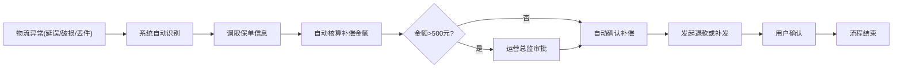
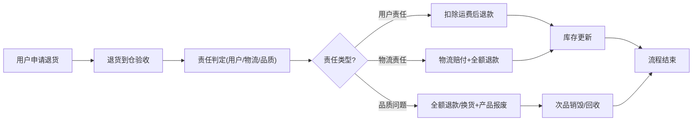

# 全球跨境电商智能仓储与多口岸通关调度平台 PRD

## 1. 产品概述
全球跨境电商智能仓储与多口岸通关调度平台是一个面向跨境电商企业的智能供应链管理系统，集成海外仓管理、智能库存调拨、订单路由优化、自动清关、物流追踪、退货管理等核心功能，实现端到端的供应链可视化与智能化。

- **核心目标**：通过AI算法优化库存布局、缩短通关时效、降低物流成本、提升订单履约率
- **目标用户**：跨境电商运营团队、关务人员、仓库管理人员、物流专员、高管决策者
- **市场价值**：解决跨境电商多仓联动、多口岸通关、跨境退换货等行业痛点，实现供应链全链路数字化管控

## 2. 核心功能

### 2.1 用户角色
| 角色 | 登录方式 | 核心权限 |
|------|----------|----------|
| 消费者 | 账号密码 | 查看个人订单、物流轨迹、申请售后 |
| 仓库主管 | 账号密码 | 管理本仓库存、处理入库出库、查看本仓报表 |
| 关务专员 | 账号密码 | 处理通关任务、追踪清关状态、处理查验工单 |
| 运营总监 | 账号密码 | 全局监控、审批调拨、查看所有报表、处理异常升级 |
| 系统管理员 | 账号密码 | 调整调拨规则、配置审批流程、用户权限管理、系统设置 |

### 2.2 功能模块
1. **首页大屏**：实时数据监控、关键指标展示、异常预警
2. **库存管理**：多仓库存查询、智能预警、调拨建议、库存调拨
3. **订单管理**：订单列表、智能分仓推荐、清关文件生成
4. **清关管理**：清关状态追踪、查验工单处理、二级审批流程
5. **物流管理**：物流追踪、异常处理、保单补偿核算
6. **退货管理**：退货入库、责任判定、退款换货报废流程
7. **报表分析**：多维度筛选、月度供应链报告、成本分析、一键导出
8. **系统管理**：权限配置、规则设置、审批流程配置

### 2.3 页面详情
| 页面名称 | 模块名称 | 功能描述 |
|----------|----------|----------|
| 首页大屏 | 实时监控 | 库存周转率、订单履约率、口岸通关时效、物流异常分布、销售额与退货率趋势，5秒自动刷新 |
| 首页大屏 | 筛选面板 | 按仓库、运输方式、目的地、日期组合筛选 |
| 库存管理 | 库存总览 | 全球各仓库库存分布、SKU热度排行、库存健康度评分 |
| 库存管理 | 智能预警 | 基于商品热度和物流时效的自动库存预警、低库存/滞销库存提醒 |
| 库存管理 | 调拨建议 | AI算法生成调拨建议、国际运输方式选择(海运/空运/铁路) |
| 库存管理 | 调拨执行 | 调拨单创建、审批、执行追踪、到达后货架分配与入库 |
| 订单管理 | 订单列表 | 订单全生命周期管理、智能推荐最优发货仓组合 |
| 订单管理 | 清关文件 | 自动生成商业发票、装箱单、报关单等清关文件 |
| 清关管理 | 清关追踪 | 多口岸清关状态实时监控、清关时效统计 |
| 清关管理 | 查验工单 | 被查验/扣留自动触发应急工单、关务主管→运营总监二级审批、超24小时未处理自动升级 |
| 物流管理 | 物流追踪 | 包裹全程轨迹追踪、实时清关拥堵指数展示 |
| 物流管理 | 异常处理 | 延误/破损/丢件处理、保单自动核算补偿金额、超500元总监审批 |
| 退货管理 | 退货处理 | 退货入库验收、责任判定(用户/物流/品质)、自动进入退款/换货/报废流程 |
| 报表分析 | 效能分析 | 供应链效能指标、成本分析、多维度数据透视 |
| 报表分析 | 报告导出 | 一键导出月度供应链效能与成本分析报告 |
| 系统管理 | 用户管理 | 用户账号、角色权限配置 |
| 系统管理 | 规则配置 | 调拨规则、审批流程、预警阈值设置 |

## 3. 核心流程

### 3.1 智能调拨流程

### 3.2 订单履约流程

### 3.3 物流异常处理流程

### 3.4 退货处理流程

## 4. 用户界面设计

### 4.1 设计风格
- **设计方向**：工业科技感 + 数据可视化大屏风格，适合B端管理系统
- **主色调**：深蓝色系（代表专业、科技、全球化）#0F172A 作为背景主色，#1E40AF 作为品牌主色
- **辅助色**：青色 #06B6D4 代表物流/运输，翠绿色 #10B981 代表正常/成功，琥珀色 #F59E0B 代表预警，红色 #EF4444 代表异常/错误
- **字体**：展示字体使用 Space Grotesk，正文字体使用 Noto Sans SC，数字使用 JetBrains Mono 等宽字体
- **布局风格**：侧边栏导航 + 内容区域卡片式布局，首页大屏采用沉浸式全屏布局
- **图标风格**：线性风格图标，使用 lucide-react 图标库
- **按钮风格**：扁平化设计，圆角4px，hover时提升阴影效果
- **动效风格**：数据滚动数字动效、图表渐入动画、状态切换平滑过渡

### 4.2 页面设计概述
| 页面名称 | 模块名称 | UI元素 |
|----------|----------|--------|
| 首页大屏 | 顶部指标栏 | 6个关键KPI卡片，带趋势箭头和环比数据，数字滚动动效 |
| 首页大屏 | 库存周转率 | 横向柱状图，各仓库对比，渐变色填充 |
| 首页大屏 | 订单履约率 | 环形进度图，实时百分比展示 |
| 首页大屏 | 口岸通关时效 | 折线图，多口岸7天趋势对比 |
| 首页大屏 | 物流异常分布 | 世界地图热力图，异常点闪烁提示 |
| 首页大屏 | 销售额与退货率 | 双Y轴组合图，面积+折线 |
| 首页大屏 | 实时预警栏 | 横向滚动最新预警信息，不同等级不同颜色 |
| 库存管理 | 库存总览 | 数据表格 + 全球仓库位置地图，支持搜索筛选 |
| 库存管理 | 调拨建议 | 智能建议卡片，显示调拨源仓、目的仓、数量、推荐运输方式、预估时效、预估成本 |
| 订单管理 | 智能分仓 | 推荐结果对比表，展示各方案的时效、成本、清关风险评分 |
| 清关管理 | 清关追踪 | 时间轴组件，展示清关各节点状态，异常节点高亮 |
| 清关管理 | 审批流程 | 审批进度条，审批人头像，审批意见输入框 |
| 物流管理 | 补偿核算 | 自动计算明细列表，各项费用清晰展示，审批按钮 |
| 退货管理 | 责任判定 | 责任判定卡片，证据图片展示，流程按钮组 |
| 报表分析 | 数据透视 | 可拖拽字段配置器，动态图表生成 |

### 4.3 响应式设计
- **设计优先级**：Desktop-first，针对1920x1080及以上分辨率优化
- **大屏适配**：首页大屏支持全屏模式，1080p/2K/4K自适应缩放
- **平板适配**：≥768px，侧边栏可折叠，表格支持横向滚动
- **移动端适配**：<768px，底部导航栏，卡片堆叠布局，核心功能优先展示

### 4.4 数据可视化特殊设计
- 世界地图采用ECharts实现，支持各区域库存热力展示
- 实时数据采用WebSocket模拟推送，每5秒刷新一次
- 数字滚动动画实现真实感的数值变化效果
- 异常状态采用脉冲呼吸灯效果，高优先级异常持续闪烁
