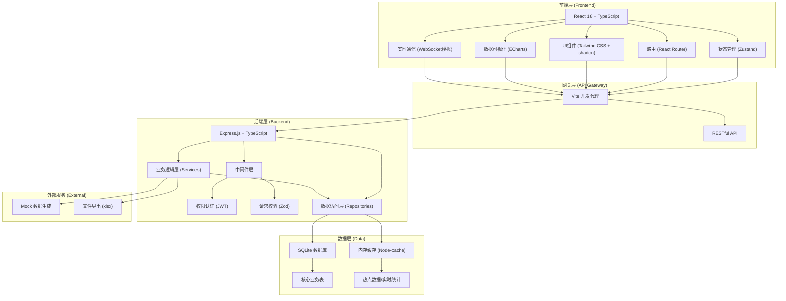
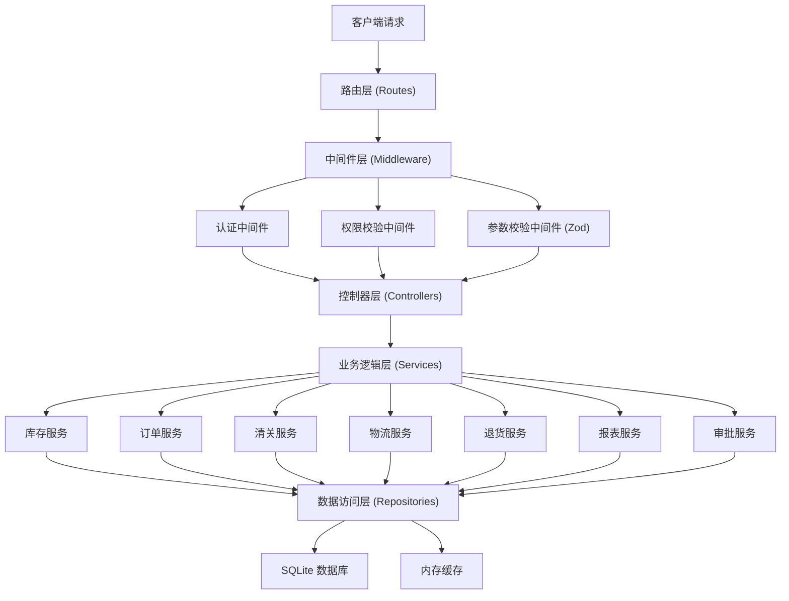
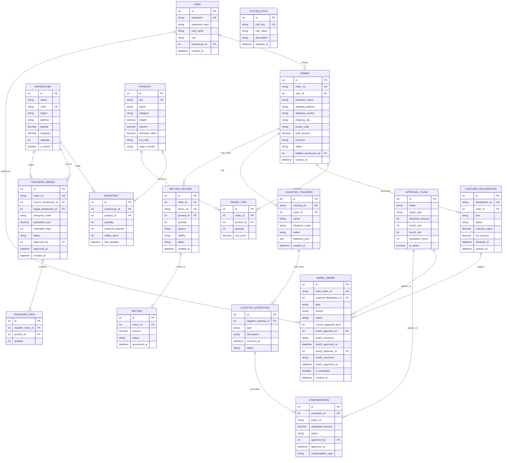

# 全球跨境电商智能仓储与多口岸通关调度平台 技术架构文档

## 1. 架构设计



## 2. 技术描述

### 2.1 技术栈选型
- **前端**：React 18 + TypeScript + Vite
- **状态管理**：Zustand（轻量级，适合中型应用）
- **路由**：React Router v6
- **样式**：Tailwind CSS 3 + shadcn/ui 组件库
- **图表**：ECharts 5（支持复杂地图、热力图）
- **后端**：Express.js 4 + TypeScript
- **数据库**：SQLite 3（无需额外服务，便于演示部署）
- **ORM**：Prisma（类型安全的数据库访问）
- **数据校验**：Zod
- **认证**：JWT (jsonwebtoken)
- **图标**：lucide-react
- **文件导出**：xlsx (SheetJS)

### 2.2 初始化工具
- 使用 `pnpm create vite-init@latest . --template react-express-ts --force` 初始化项目

## 3. 路由定义

| 路由路径 | 页面名称 | 访问权限 | 说明 |
|----------|----------|----------|------|
| /login | 登录页 | 公开 | 用户登录入口 |
| / | 首页大屏 | 运营总监/管理员 | 实时数据监控大屏，5秒刷新 |
| /inventory | 库存总览 | 仓库主管/运营总监/管理员 | 全球多仓库存查询 |
| /inventory/alert | 库存预警 | 仓库主管/运营总监/管理员 | 智能库存预警列表 |
| /inventory/transfer | 库存调拨 | 运营总监/管理员 | 调拨建议与执行 |
| /orders | 订单列表 | 运营总监/管理员 | 订单全生命周期管理 |
| /orders/optimize | 智能分仓 | 运营总监/管理员 | 最优发货仓推荐 |
| /customs | 清关管理 | 关务专员/运营总监/管理员 | 清关状态追踪 |
| /customs/workorder | 应急工单 | 关务专员/运营总监/管理员 | 查验工单处理与审批 |
| /logistics | 物流追踪 | 所有登录用户 | 包裹物流轨迹查询 |
| /logistics/exception | 异常处理 | 运营总监/管理员 | 物流异常与补偿核算 |
| /returns | 退货管理 | 仓库主管/运营总监/管理员 | 退货处理与责任判定 |
| /reports | 报表分析 | 运营总监/管理员 | 供应链效能分析 |
| /reports/export | 报告导出 | 运营总监/管理员 | 月度报告一键导出 |
| /system/users | 用户管理 | 管理员 | 用户账号与权限配置 |
| /system/rules | 规则配置 | 管理员 | 调拨规则与审批流程配置 |
| /consumer/orders | 我的订单 | 消费者 | 消费者查看个人订单 |

## 4. API 定义

### 4.1 类型定义
```typescript
// 通用响应
interface ApiResponse<T> {
  code: number;
  message: string;
  data: T;
  timestamp: number;
}

// 分页响应
interface PaginatedResponse<T> {
  items: T[];
  total: number;
  page: number;
  pageSize: number;
  totalPages: number;
}

// 用户角色
type UserRole = 'consumer' | 'warehouse_manager' | 'customs_officer' | 'operation_director' | 'admin';

// 仓库区域
type Region = 'US' | 'EU' | 'SoutheastAsia' | 'China';

// 运输方式
type TransportMode = 'sea' | 'air' | 'rail';

// 清关状态
type CustomsStatus = 'pending' | 'declared' | 'inspecting' | 'detained' | 'cleared' | 'rejected';

// 物流异常类型
type LogisticsExceptionType = 'delay' | 'damage' | 'lost';

// 退货责任类型
type ReturnLiability = 'customer' | 'logistics' | 'quality';

// 审批状态
type ApprovalStatus = 'pending' | 'approved' | 'rejected' | 'escalated';
```

### 4.2 核心API接口

| 接口路径 | 方法 | 说明 | 请求参数 | 响应数据 |
|----------|------|------|----------|----------|
| `/api/auth/login` | POST | 用户登录 | `{ username, password }` | `{ token, userInfo, permissions }` |
| `/api/dashboard/realtime` | GET | 获取首页实时数据 | `{ warehouseId?, region?, dateRange? }` | 大屏KPI数据 |
| `/api/inventory` | GET | 获取库存列表 | `{ page, pageSize, warehouseId?, sku? }` | 分页库存数据 |
| `/api/inventory/alert` | GET | 获取库存预警 | `{ alertType? }` | 预警列表 |
| `/api/inventory/transfer/suggestion` | GET | 获取调拨建议 | - | AI调拨建议列表 |
| `/api/inventory/transfer` | POST | 创建调拨单 | `{ sourceWarehouseId, targetWarehouseId, skuItems, transportMode }` | 调拨单信息 |
| `/api/inventory/transfer/:id/approve` | POST | 审批调拨单 | `{ status, comment }` | 审批结果 |
| `/api/orders` | GET | 获取订单列表 | `{ page, pageSize, status?, dateRange? }` | 分页订单数据 |
| `/api/orders/:id/optimize` | GET | 获取智能分仓方案 | - | 分仓推荐方案 |
| `/api/orders/:id/documents` | POST | 生成清关文件 | `{ documentTypes }` | 文件下载链接 |
| `/api/customs` | GET | 获取清关列表 | `{ page, pageSize, status?, port? }` | 分页清关数据 |
| `/api/customs/:id/track` | GET | 清关轨迹 | - | 清关时间轴数据 |
| `/api/customs/workorder` | GET | 获取应急工单 | `{ status? }` | 工单列表 |
| `/api/customs/workorder/:id/approve` | POST | 工单审批 | `{ level, status, comment }` | 审批结果 |
| `/api/logistics/:trackingNo` | GET | 物流追踪 | - | 物流轨迹 |
| `/api/logistics/exception` | GET | 异常列表 | `{ type? }` | 异常列表 |
| `/api/logistics/exception/:id/calculate` | GET | 补偿核算 | - | 补偿金额明细 |
| `/api/logistics/exception/:id/approve` | POST | 补偿审批 | `{ status, comment }` | 审批结果 |
| `/api/returns` | GET | 退货列表 | `{ status? }` | 退货列表 |
| `/api/returns/:id/judge` | POST | 责任判定 | `{ liability, comment }` | 判定结果 |
| `/api/reports/supply-chain` | GET | 供应链效能数据 | `{ dateRange, warehouseId?, transportMode? }` | 效能分析数据 |
| `/api/reports/export` | POST | 导出报告 | `{ reportType, dateRange, filters }` | 文件下载链接 |
| `/api/system/users` | GET | 用户列表 | `{ page, pageSize }` | 用户列表 |
| `/api/system/rules` | GET | 规则列表 | - | 规则配置 |
| `/api/system/rules` | PUT | 更新规则 | `{ rules }` | 更新结果 |

## 5. 服务器架构图



## 6. 数据模型

### 6.1 ER图



### 6.2 DDL 语句
```sql
-- 用户表
CREATE TABLE IF NOT EXISTS user (
  id INTEGER PRIMARY KEY AUTOINCREMENT,
  username VARCHAR(50) UNIQUE NOT NULL,
  password_hash VARCHAR(255) NOT NULL,
  real_name VARCHAR(50) NOT NULL,
  role VARCHAR(20) NOT NULL,
  warehouse_id INTEGER,
  created_at DATETIME DEFAULT CURRENT_TIMESTAMP,
  FOREIGN KEY (warehouse_id) REFERENCES warehouse(id)
);

-- 仓库表
CREATE TABLE IF NOT EXISTS warehouse (
  id INTEGER PRIMARY KEY AUTOINCREMENT,
  name VARCHAR(100) NOT NULL,
  code VARCHAR(20) UNIQUE NOT NULL,
  region VARCHAR(20) NOT NULL,
  address TEXT,
  latitude DECIMAL(10, 7),
  longitude DECIMAL(10, 7),
  capacity INTEGER DEFAULT 0,
  is_active BOOLEAN DEFAULT 1
);

-- 商品表
CREATE TABLE IF NOT EXISTS product (
  id INTEGER PRIMARY KEY AUTOINCREMENT,
  sku VARCHAR(50) UNIQUE NOT NULL,
  name VARCHAR(200) NOT NULL,
  category VARCHAR(50),
  weight DECIMAL(10, 3),
  volume DECIMAL(10, 3),
  declared_value DECIMAL(12, 2),
  hs_code VARCHAR(20),
  origin_country VARCHAR(50)
);

-- 库存表
CREATE TABLE IF NOT EXISTS inventory (
  id INTEGER PRIMARY KEY AUTOINCREMENT,
  warehouse_id INTEGER NOT NULL,
  product_id INTEGER NOT NULL,
  quantity INTEGER DEFAULT 0,
  reserved_quantity INTEGER DEFAULT 0,
  safety_stock INTEGER DEFAULT 0,
  last_updated DATETIME DEFAULT CURRENT_TIMESTAMP,
  FOREIGN KEY (warehouse_id) REFERENCES warehouse(id),
  FOREIGN KEY (product_id) REFERENCES product(id),
  UNIQUE(warehouse_id, product_id)
);

-- 调拨单表
CREATE TABLE IF NOT EXISTS transfer_order (
  id INTEGER PRIMARY KEY AUTOINCREMENT,
  order_no VARCHAR(50) UNIQUE NOT NULL,
  source_warehouse_id INTEGER NOT NULL,
  target_warehouse_id INTEGER NOT NULL,
  transport_mode VARCHAR(10) NOT NULL,
  estimated_cost DECIMAL(12, 2),
  estimated_days INTEGER,
  status VARCHAR(20) DEFAULT 'pending',
  approved_by INTEGER,
  approved_at DATETIME,
  created_at DATETIME DEFAULT CURRENT_TIMESTAMP,
  FOREIGN KEY (source_warehouse_id) REFERENCES warehouse(id),
  FOREIGN KEY (target_warehouse_id) REFERENCES warehouse(id),
  FOREIGN KEY (approved_by) REFERENCES user(id)
);

-- 调拨明细表
CREATE TABLE IF NOT EXISTS transfer_item (
  id INTEGER PRIMARY KEY AUTOINCREMENT,
  transfer_order_id INTEGER NOT NULL,
  product_id INTEGER NOT NULL,
  quantity INTEGER NOT NULL,
  FOREIGN KEY (transfer_order_id) REFERENCES transfer_order(id),
  FOREIGN KEY (product_id) REFERENCES product(id)
);

-- 订单表
CREATE TABLE IF NOT EXISTS order_table (
  id INTEGER PRIMARY KEY AUTOINCREMENT,
  order_no VARCHAR(50) UNIQUE NOT NULL,
  user_id INTEGER,
  customer_name VARCHAR(100) NOT NULL,
  shipping_address TEXT NOT NULL,
  shipping_country VARCHAR(50) NOT NULL,
  shipping_city VARCHAR(50),
  postal_code VARCHAR(20),
  total_amount DECIMAL(12, 2) NOT NULL,
  currency VARCHAR(3) DEFAULT 'USD',
  status VARCHAR(20) DEFAULT 'pending',
  fulfilled_warehouse_id INTEGER,
  created_at DATETIME DEFAULT CURRENT_TIMESTAMP,
  FOREIGN KEY (user_id) REFERENCES user(id),
  FOREIGN KEY (fulfilled_warehouse_id) REFERENCES warehouse(id)
);

-- 订单明细表
CREATE TABLE IF NOT EXISTS order_item (
  id INTEGER PRIMARY KEY AUTOINCREMENT,
  order_id INTEGER NOT NULL,
  product_id INTEGER NOT NULL,
  quantity INTEGER NOT NULL,
  unit_price DECIMAL(12, 2) NOT NULL,
  FOREIGN KEY (order_id) REFERENCES order_table(id),
  FOREIGN KEY (product_id) REFERENCES product(id)
);

-- 清关表
CREATE TABLE IF NOT EXISTS customs_declaration (
  id INTEGER PRIMARY KEY AUTOINCREMENT,
  declaration_no VARCHAR(50) UNIQUE NOT NULL,
  order_id INTEGER NOT NULL,
  port VARCHAR(50) NOT NULL,
  status VARCHAR(20) DEFAULT 'pending',
  customs_value DECIMAL(12, 2),
  tax_amount DECIMAL(12, 2),
  declared_at DATETIME,
  cleared_at DATETIME,
  FOREIGN KEY (order_id) REFERENCES order_table(id)
);

-- 应急工单表
CREATE TABLE IF NOT EXISTS work_order (
  id INTEGER PRIMARY KEY AUTOINCREMENT,
  work_order_no VARCHAR(50) UNIQUE NOT NULL,
  customs_declaration_id INTEGER NOT NULL,
  type VARCHAR(20) NOT NULL,
  priority VARCHAR(10) DEFAULT 'normal',
  status VARCHAR(20) DEFAULT 'pending',
  current_approval_level INTEGER DEFAULT 1,
  level1_approver_id INTEGER,
  level1_comment TEXT,
  level1_approved_at DATETIME,
  level2_approver_id INTEGER,
  level2_comment TEXT,
  level2_approved_at DATETIME,
  is_escalated BOOLEAN DEFAULT 0,
  created_at DATETIME DEFAULT CURRENT_TIMESTAMP,
  FOREIGN KEY (customs_declaration_id) REFERENCES customs_declaration(id),
  FOREIGN KEY (level1_approver_id) REFERENCES user(id),
  FOREIGN KEY (level2_approver_id) REFERENCES user(id)
);

-- 物流追踪表
CREATE TABLE IF NOT EXISTS logistics_tracking (
  id INTEGER PRIMARY KEY AUTOINCREMENT,
  tracking_no VARCHAR(50) UNIQUE NOT NULL,
  order_id INTEGER NOT NULL,
  carrier VARCHAR(50) NOT NULL,
  transport_mode VARCHAR(10) NOT NULL,
  status VARCHAR(20) DEFAULT 'in_transit',
  trajectory_json TEXT,
  created_at DATETIME DEFAULT CURRENT_TIMESTAMP,
  FOREIGN KEY (order_id) REFERENCES order_table(id)
);

-- 物流异常表
CREATE TABLE IF NOT EXISTS logistics_exception (
  id INTEGER PRIMARY KEY AUTOINCREMENT,
  logistics_tracking_id INTEGER NOT NULL,
  type VARCHAR(20) NOT NULL,
  description TEXT,
  occurred_at DATETIME,
  status VARCHAR(20) DEFAULT 'pending',
  FOREIGN KEY (logistics_tracking_id) REFERENCES logistics_tracking(id)
);

-- 补偿表
CREATE TABLE IF NOT EXISTS compensation (
  id INTEGER PRIMARY KEY AUTOINCREMENT,
  exception_id INTEGER NOT NULL,
  policy_no VARCHAR(50),
  calculated_amount DECIMAL(12, 2) NOT NULL,
  status VARCHAR(20) DEFAULT 'pending',
  approved_by INTEGER,
  approved_at DATETIME,
  compensation_type VARCHAR(20),
  FOREIGN KEY (exception_id) REFERENCES logistics_exception(id),
  FOREIGN KEY (approved_by) REFERENCES user(id)
);

-- 退货表
CREATE TABLE IF NOT EXISTS return_record (
  id INTEGER PRIMARY KEY AUTOINCREMENT,
  order_id INTEGER NOT NULL,
  return_no VARCHAR(50) UNIQUE NOT NULL,
  product_id INTEGER NOT NULL,
  quantity INTEGER NOT NULL,
  reason TEXT,
  liability VARCHAR(20),
  status VARCHAR(20) DEFAULT 'pending',
  created_at DATETIME DEFAULT CURRENT_TIMESTAMP,
  FOREIGN KEY (order_id) REFERENCES order_table(id),
  FOREIGN KEY (product_id) REFERENCES product(id)
);

-- 退款表
CREATE TABLE IF NOT EXISTS refund (
  id INTEGER PRIMARY KEY AUTOINCREMENT,
  return_id INTEGER NOT NULL,
  amount DECIMAL(12, 2) NOT NULL,
  status VARCHAR(20) DEFAULT 'pending',
  processed_at DATETIME,
  FOREIGN KEY (return_id) REFERENCES return_record(id)
);

-- 审批流程表
CREATE TABLE IF NOT EXISTS approval_flow (
  id INTEGER PRIMARY KEY AUTOINCREMENT,
  name VARCHAR(100) NOT NULL,
  target_type VARCHAR(50) NOT NULL,
  threshold_amount DECIMAL(12, 2) DEFAULT 0,
  level1_role VARCHAR(20) NOT NULL,
  level2_role VARCHAR(20) NOT NULL,
  escalation_hours INTEGER DEFAULT 24,
  is_active BOOLEAN DEFAULT 1
);

-- 系统规则表
CREATE TABLE IF NOT EXISTS system_rule (
  id INTEGER PRIMARY KEY AUTOINCREMENT,
  rule_key VARCHAR(50) UNIQUE NOT NULL,
  rule_value TEXT NOT NULL,
  description TEXT,
  updated_at DATETIME DEFAULT CURRENT_TIMESTAMP
);
```

### 6.3 初始化数据
```sql
-- 初始化仓库数据
INSERT INTO warehouse (name, code, region, address, latitude, longitude, capacity, is_active) VALUES
('洛杉矶仓', 'WH-LA', 'US', '123 Logistics Ave, Los Angeles, CA 90001', 34.0522, -118.2437, 50000, 1),
('新泽西仓', 'WH-NJ', 'US', '456 Distribution Dr, Newark, NJ 07102', 40.7357, -74.1724, 40000, 1),
('鹿特丹仓', 'WH-RTM', 'EU', '789 Havenstraat, Rotterdam 3072 AP', 51.9244, 4.4777, 45000, 1),
('汉堡仓', 'WH-HAM', 'EU', '321 Hafenstraße, Hamburg 20359', 53.5511, 9.9937, 35000, 1),
('新加坡仓', 'WH-SG', 'SoutheastAsia', '654 Jurong Port Rd, Singapore 619158', 1.3048, 103.7189, 30000, 1),
('曼谷仓', 'WH-BKK', 'SoutheastAsia', '987 Logistics Park, Bangkok 10150', 13.7563, 100.5018, 25000, 1),
('深圳仓', 'WH-SZ', 'China', '147 深圳保税区', 22.5431, 114.0579, 60000, 1);

-- 初始化用户数据 (密码: 123456)
INSERT INTO user (username, password_hash, real_name, role, warehouse_id) VALUES
('admin', '$2b$10$N9qo8uLOickgx2ZMRZoMyeIjZAgcfl7p92ldGxad68LJZdL17lhWy', '系统管理员', 'admin', NULL),
('director', '$2b$10$N9qo8uLOickgx2ZMRZoMyeIjZAgcfl7p92ldGxad68LJZdL17lhWy', '张总监', 'operation_director', NULL),
('customs1', '$2b$10$N9qo8uLOickgx2ZMRZoMyeIjZAgcfl7p92ldGxad68LJZdL17lhWy', '李关务', 'customs_officer', NULL),
('wh_la', '$2b$10$N9qo8uLOickgx2ZMRZoMyeIjZAgcfl7p92ldGxad68LJZdL17lhWy', '王主管', 'warehouse_manager', 1),
('wh_rtm', '$2b$10$N9qo8uLOickgx2ZMRZoMyeIjZAgcfl7p92ldGxad68LJZdL17lhWy', 'Pierre', 'warehouse_manager', 3),
('consumer1', '$2b$10$N9qo8uLOickgx2ZMRZoMyeIjZAgcfl7p92ldGxad68LJZdL17lhWy', '消费者小明', 'consumer', NULL);

-- 初始化审批流程
INSERT INTO approval_flow (name, target_type, threshold_amount, level1_role, level2_role, escalation_hours) VALUES
('清关查验工单审批', 'work_order', 0, 'customs_officer', 'operation_director', 24),
('物流补偿审批', 'compensation', 500, 'customs_officer', 'operation_director', 24),
('库存调拨审批', 'transfer_order', 10000, 'warehouse_manager', 'operation_director', 48);

-- 初始化系统规则
INSERT INTO system_rule (rule_key, rule_value, description) VALUES
('safety_stock_days_us', '30', '美国仓安全库存天数'),
('safety_stock_days_eu', '45', '欧洲仓安全库存天数'),
('safety_stock_days_asia', '20', '东南亚仓安全库存天数'),
('transport_cost_sea', '0.5', '海运成本(美元/kg)'),
('transport_cost_air', '5.0', '空运成本(美元/kg)'),
('transport_cost_rail', '1.5', '铁路成本(美元/kg)'),
('transport_days_sea', '35', '海运时效(天)'),
('transport_days_air', '7', '空运时效(天)'),
('transport_days_rail', '21', '铁路时效(天)');
```
